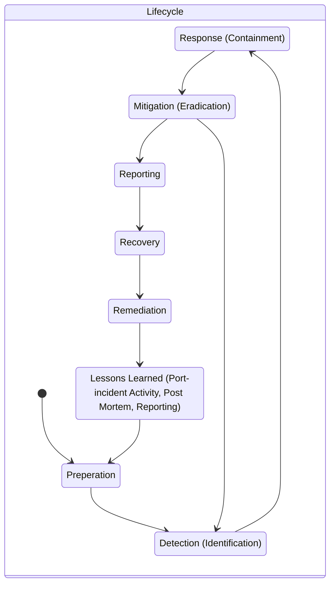

# Domain 7 - Security Operations

## Administrative Personnel Security Controls

### Administrative Security

- Provides the means to control peoples operation access to data
- Least Privilege
- Need-to-know
  -  Even if you have access, if you don't need to know, then you should not access the data

- Job rotation
  - detect error / fraud
- Seperation of Duties
- privilege monitoring
- NDA
- Background Checks

### Digital Forensics

- focus on the recovery and investigation
- prove evidence integrity


- any evidence must be
  - accurate
  - complete
  - authentic
  - convincing
  - admissible

##### Identification

- identify the evidence

##### Preservation

- document everything
- do hash of evidence
  - chain of custody

##### Collection

- document everything
- we handle the evidence as little as possible
- work from most volatile to least volatile
  - RAM to DISK
- we use incident response plan
- this includes Legal and HR
  - 4th amendment

##### Examination

- find facts, document

##### Analytics

- look at the data and look for meaning or reason

##### Preservation in court

- we present our findings

##### Decision

- the court rules on the case

#### Real evidence

- tangible and physical objects

#### CHain of custody

- who handled it?
- when did the handle it?
- what did they do with it?
- where did they do it?

### Network forensics

- deal with volatile and dynamic
- two uses
  - IDS / IPS
  - capture traffic for law enforcement
- Systems to use
  - catch-it-as-you-can
  - stop, look and listen
- Software analysis
  - comparing / reverse-engineer software

### Incident Management

- 3 categories
  - material
  - human (intentional / unintentional)
  - environmental
- Events
  - change in state
- Alert
  - trigger warning if a certain event occurs
- Incident
  - multiple advewrse events happen
- Problem
  - Incident without known cause
- Inconvinience (non-disasters)
  - non-disruptive failure
- Emergency (Crisis)
  - Urgent, event with potential for loss of life / property
- Disaster
  - the entire facility is unusable for 24h or more
- Catastrophe
  - Facility is destroyed

#### 7(+1)-Step Lifecycle



* Detection
  * Events are analyzed
* Response
  * Interacting with the system
* Mitigation
  * backup / restore
* Reporting
  * 2 focus: tech and non-tech
* Recovery
  * carefully restore the system
* Remediation
  * patching every other systems
* Lessons Learned
  * report to senior management
  * root-cause analysis

#### preventive / detective controls 

##### IDS / IPS

- network based
- host based
- signature based
- heuristic based
- Attacks to avoid
  - Fragmentation
  - Avoiding defaults
  - Low-Bandwidth coordinated attacks
  - spoofing / proxying
  - pattern change evasion
- Categories
  - True positive
  - True negative
  - False positive
  - False negative

##### SIEM

- provide holistic view
- gather logs
- centralizes the storage and interpretation of logs

##### Application whitelisting

- whitelist against trusted digitial certificate a known hash or path and name

##### Removable Media Controls

- lock down USB / CD / Memory Card etc.

##### Honey Pots / Honey Nets

- used internally and externally
- need to have approval
- look like a real system

##### Configuration management

- we do this for every device
- use images
- run vulnerability scans before production

##### Patch management

- in order to keep our network secure
- SCCM / WSUS

##### Change Management

- formalized process

- full documentation

  ```mermaid
  stateDiagram-v2
       state Change-Flow {
       [*] --> Identify
       Identify --> Propose 
       Propose --> Assess
       Assess --> Provision
       Provision --> Testing
       Testing --> Schedule
       Schedule --> Notification
       Notification --> Implementation
       Implementation --> Report
       Report --> [*]
       }
  ```

- closely monitor the change

  - change control

##### 0-Day Attacks

- 1% of the code has errors
- not known or used before
- behaviour based IPS / IDS might be ablte to detect this abnormality

##### Backups

- Fault Tolerance
  - internal SLA's
  - provide as high availability as possible
  - we use a high degree of redundancy and resiliency as makes sense
  - requires a plan!
- Full Backup
  - Backup all
  - clears all archive bits
- Incremental
  - Backup all, since the last (full/incremental) backup
  - clears all archive bits
- Differantial
  - Backup only the changed data, since last full backup
  - doesn't clear the archive bit
- Copy Backup
  - like full backup / on demand

##### RAID

 - Disk Mirroring
   	- write the same data across multiple disk
      	- slower
      	- needs > 2 Disk
 - Disk Striping
    - writing the data simultanuasly accross disk
    - higher speed
    - without parity > 2 disks
    - with parity > 3 disks

#### Continuity of Operations

##### Redundancy

- DISK -> RAID
- Power -> USP / multiple PSU
- Network -> port teaming
- Load Balancing 
- multiple servers

##### System Redundancy

- Database shadowing
- e-vaulting
- backups are send off-site

##### BCP - Business Continuity Plan

- written ahead of time and continually improved
- long-term strategic business plan, policies, procedures for continued operation after a disruptive event
- contains
  - COOP - Continuity of Operations Plan
  - Crisis Communication Plan
    - how do we communicate external?
    - call-trees
      - starts buttom-up and then top-down
      - pref. automated
  - Critical Infrastructure Protection Plan
  - Cyber Incident Response Plan
  - Disaster Recovery Plan
    - short-term plans
  - ISCP - Information System Contingency Plan
  - Occupant Emergency Plan
    - Evac Plan

##### Disaster Categories 

- Natural
  - caused by nature
  - very devastating but not often
- Human
  - caused by humans
  - intentional / unintentional
  - For Example
    - errors and omissions / warfare / terror / sabotage / state, cause or religious hacking, financially motivated attackers
    - most common reason for disruptive events are internal employees
  - minor impact
  - easy to mitigate
- Environmental
  - Electrical or Power problems
  - Heat
  - Pressure
  - Humidity

#### DRP Basics

- What is the objective and purpose
- Who will be the people or teams who will be responsible in case any disruption happen
- What will these people do when the disaster hits

````mermaid
stateDiagram-v2
s1: Education, Plans, Processes, Training
	s1 --> Preparation
	Preparation --> Response
	note left of Response: DR / BCP / EOP 
	Response --> Recovery
	note left of Recovery: post-disaster recovery plan
	Recovery --> Mitigation
	note left of Mitigation: pre-disaster mitigation plan
	Mitigation --> Preparation

````

###### Response

- How we react / response?
- We assess the incident
- we notify

###### Recovery

- reestablish basic functionality
- all key stakeholders should be involved
- we act on our assesment plan

##### Develop our BCP and DCP

1. Project Initiation
2. Scope the project
3. Business Impact Analysis
4. Identify Preventive Controls
5. Recovery Strategy
6. Plan Design and Development
7. Implementation, Training and Testing
8. BCP / DRP Maintenance

- Senior Management needs to be on board!
  - at least at the initiation and final approval
  - they are responsible
  - we need top-down IT security
  - in serious disasters also legal team
- BCP Team
  - Rescue Team (activation / notification)
  - Recovery Team (failover)
  - Salvage Team (failback)

#### BIA - Business Impact Analysis

- identifies critical and non-critical
- **critical** is where disruption is not acceptable
- for each critical system two values are assigned
  - **RPO**
    - Amount of data which is "OK" to lost
  - **MTD**
    - MTD >= RTO + WRT
    - maximum tolerable downtime
  - RTO
    - recovery time objective
    - the amount of time to restore the system (hardware)
  - WRT
    - work recovery time
    - how long does it take to re-configure a recovered system
- MTBF - Meantime between failures
- MTTR - Meantime to repair
- MOR - minimum operating requirements

#### Supply and Infrastructure Redundancy

- If an earthquake hits, are the supplies able to deliver?
- How long can we be without water?

##### Disaster recovery sites

- Redundant site
  - complete identical, has staff on site
- Hot Site
  - houses any critical applications and systems
- Warm Site
  - often restore with backups
  - manually fail traffic over
- Cold Site
  - just the datacenter without hardware
- Reciprocal aggreement Site
  - Organization has a contract with another organization that they will give you space in their datacenter
  - promised space / cloud / mobile site

#### Employee redundancy

- Offsite copies and plans
- EOC (Emergency Operation Center) - temporary
- MOU / MOA - Memorandum of Understandig / Agreement
- we need a plan if the key employee is not available
- we need a high degree of skilled employee redundandcy just like we have on our critical hardware
- can be mitigated with trainign and job rotation

#### Testing the plans

- Simulated Tests
  - DRP review
    - done by team members which are involved by the DRP
  - read-through (checklist)
    - checklist components
  - walk/talk-through
    - manager / critical personnel
  - Simulation test
- Physical Tests
  - Parallel Processing
  - Parallel Interruption
  - Full Interruption
- Plans need to be continually updated it is an iterative process
- If a mayor change is in the organization,  we update the plans
  - old plans are archived but not deleted

###### Testing

- to ensure the plan is accurate, complete and effective

###### Drills

- walkthroughs of the plan, focus to train staff

###### Auditing 

- A 3rd party ensures that the plan is understood, followed, in-plan and effective

#### After a disruption

- common mistakes to avoid

  - lack of senior leadership support
  - lack of involvement from business units
  - lack of critical staff priotization
  - to narrow scope
  - inadequate telecommunication and supply chain management
  - lack of testing
  - lack of training and awareness
  - not keeping the BCP / DRP up to date, or no paper versioning controls

- ##### Guidelines

- [NIST.SP.800-34r1](../../files/NIST/NIST.SP.800-34r1.pdf)

- [ISO 22301](https://en.wikipedia.org/wiki/ISO_22301)

- [ISO / IEC 27301](https://iso27001security.com/html/27031.html)

- Business Continuity Institute 

  - [Good Practice Guidelines](https://www.thebci.org/resource/good-practice-guidelines--2018-edition-.html)


